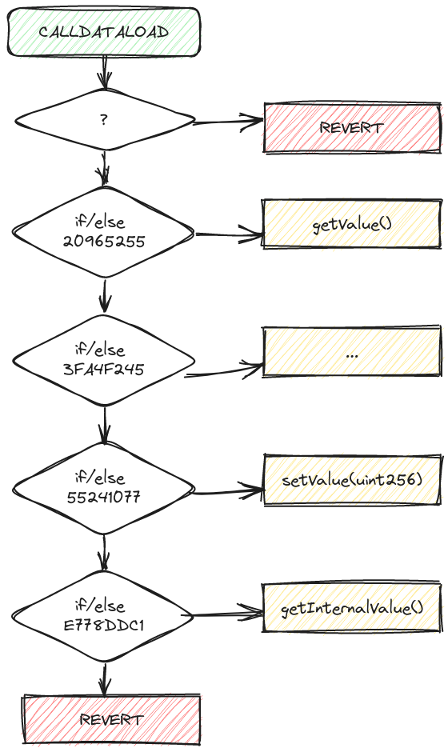
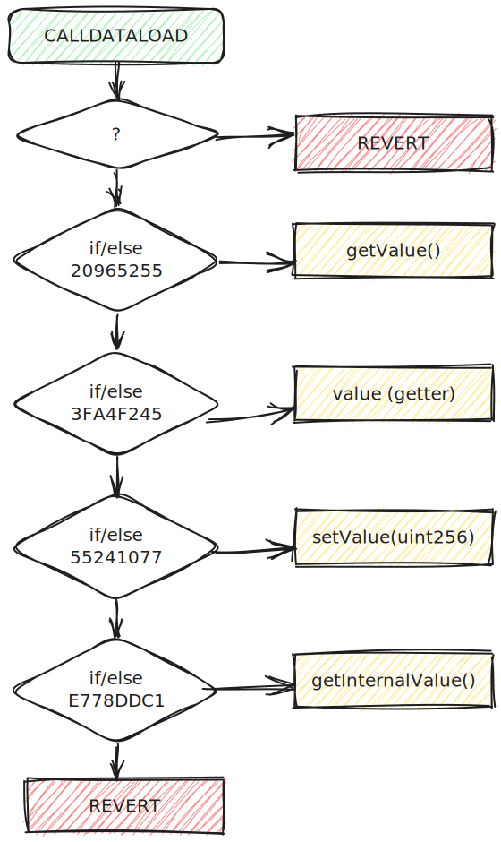
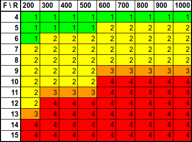

# Optimisation sur Ethereum : Faites la différence avec les noms de fonctions 

<!-- TOC -->

- [Optimisation sur Ethereum : Faites la différence avec les noms de fonctions](#optimisation-sur-ethereum--faites-la-diff%C3%A9rence-avec-les-noms-de-fonctions)
	- [TL;DR](#tldr)
	- [Introduction](#introduction)
	- [Empreintes et signatures des fonctions](#empreintes-et-signatures-des-fonctions)
	- [Présentation du "function dispatcher"](#pr%C3%A9sentation-du-function-dispatcher)
		- [Fonctionnement](#fonctionnement)
		- [En Solidity](#en-solidity)
			- [Rappel sur les visibilités des fonctions Solidity](#rappel-sur-les-visibilit%C3%A9s-des-fonctions-solidity)
			- [À la compilation](#%C3%A0-la-compilation)
				- [Code généré](#code-g%C3%A9n%C3%A9r%C3%A9)
				- [Diagramme](#diagramme)
				- [Ordre d'évaluation](#ordre-d%C3%A9valuation)
				- [Getter automatique](#getter-automatique)
		- [En Yul](#en-yul)
	- [Une complexité croissante !](#une-complexit%C3%A9-croissante-)
		- [Influence du niveau de runs](#influence-du-niveau-de-runs)
		- [Onze fonctions et mille runs](#onze-fonctions-et-mille-runs)
		- [Pseudo-code](#pseudo-code)
		- [Calcul des coûts en gas](#calcul-des-co%C3%BBts-en-gas)
		- [Statistiques de consommation](#statistiques-de-consommation)
	- [Algorithmes et ordre de traitement](#algorithmes-et-ordre-de-traitement)
		- [Recherche linéaire runs = 200](#recherche-lin%C3%A9aire-runs--200)
		- [Recherche fractionnée runs = 1000](#recherche-fractionn%C3%A9e-runs--1000)
	- [Les optimisations](#les-optimisations)
		- [Optimisation des coûts d'exécution](#optimisation-des-co%C3%BBts-dex%C3%A9cution)
		- [Optimisation des coûts intrinsèques](#optimisation-des-co%C3%BBts-intrins%C3%A8ques)
	- [Select0r](#select0r)
	- [Conclusions](#conclusions)
	- [Ressources additionnelles](#ressources-additionnelles)

<!-- /TOC -->


## TL;DR

1. L'optimisation des coûts en gas est cruciale pour les contrats intelligents sur Ethereum.
2. Le "*function dispatcher*" gère l'exécution des fonctions dans les smart contracts pour les EVMs.
3. Le compilateur Solidity génère le "*function dispatcher*" des fonctions exposées publiquement, alors qu'en Yul cela doit être codé.
4. Les signatures, hashs et empreintes des fonctions sont déterminés par leurs noms et types de paramètres.
5. Le réglage d'optimisation du compilateur et le nombre de fonctions impactent l'algorithme de sélection des fonctions.
6. Le renommage stratégique des fonctions optimise les coûts en gas et l'ordre de sélection, de par les valeurs des empreintes.


## Introduction

L'optimisation des coûts en gas est un enjeu clé dans le développement de contrats intelligents sur la blockchain Ethereum, chaque opération effectuée sur Ethereum ayant un coût en gas. Cet article sera aussi l'occasion de fournir du contenu aux lecteurs francophones.

**Rappel :**

- Le **bytecode** représente un smart contract sur la blockchain sous forme d'une séquence d'hexadécimaux.
- La machine virtuelle Ethereum (**EVM**) exécute les instructions en lisant ce bytecode lors de l'interaction avec le contrat.
- Chaque instruction élémentaire, codée sur un octet, est appelée **opcode** et a un coût en gas qui reflète les ressources nécessaires à son exécution.
- Un compilateur traduit ce code source en bytecode exécutable par l'EVM et fournit des éléments tels que l'ABI (interface binaire d'application).
- Une **ABI** définit comment les fonctions d'un contrat doivent être appelées et les données échangées, en spécifiant les types de données des arguments et la signature des fonctions.

Dans cet article, nous allons explorer comment le simple fait de nommer vos fonctions peut influencer les coûts en gas associés à votre contrat.

Nous discuterons également de diverses stratégies d'optimisation, de l'ordre des hash de signatures aux astuces de renommage des fonctions, afin de réduire les coûts associés aux interactions avec vos contrats.

**Précisions :**

Cette article se base sur :
1. Du code **Solidity** (0.8.13, 0.8.17, 0.8.20, 0.8.22)
2. Compilé avec le compilateur `solc`
3. Pour des **EVMs** sur **Ethereum**

Les concepts suivants seront abordés :
- L'empreinte : l'identitifiant numérique d'une fonction au sein de l'EVM.
- Le "*function dispatcher*" : le mécanisme de sélection d'une fonction dans un contrat.
- Et le nom de fonction en tant qu'argument (du côté de l'appelant).


## Empreintes et signatures des fonctions

La **signature** d'une fonction tel qu'employée avec les **EVMs** (Solidity) consiste en la concaténation de son nom et de ses types de paramètres (sans type de retour ni espaces)

L'**empreinte** ("function selector" dans les publications anglo-saxonnes) est l'empreinte même de la fonction qui la rend "unique" et identifiable. Dans le cas de Solidity, il s'agit des 4 octets de poids fort (32 bits) du résultat du hachage de la signature de la fonction avec l'algorithme [**Keccak-256**](https://www.geeksforgeeks.org/difference-between-sha-256-and-keccak-256/) (🇬🇧).

Cela selon les [**spécifications de l'ABI en Solidity**](https://docs.soliditylang.org/en/develop/abi-spec.html#function-selector)  (🇬🇧).

Je précise à nouveau que je parle de l'empreinte pour le compilateur **solc** pour **Solidity**, ce n'est pas forcément le cas avec d'autres langages comme **Rust** qui fonctionne sur un tout autre paradigme.

Si les types des paramètres sont pris en compte, c'est pour différencier les fonctions qui auraient le même nom, mais des paramètres différents, comme pour la méthode `safeTransferFrom` des tokens  [**ERC721**](https://eips.ethereum.org/EIPS/eip-721)  (🇬🇧).

Cependant, le fait que l'on ne garde que **quatre octets** pour l'empreinte, implique de potentiels **risques de collisions de hash** entre deux fonctions, risque rare mais existant malgré plus de 4 milliards de possibilités (2^32).

Comme en atteste le site [**Ethereum Signature Database**](https://www.4byte.directory/signatures/?bytes4_signature=0xcae9ca51)  (🇬🇧) avec l'exemple suivant :

| Empreintes   | Signatures                                                   |
| ------------ | ------------------------------------------------------------ |
| `0xcae9ca51` | `onHintFinanceFlashloan(address,address,uint256,bool,bytes)` |
| `0xcae9ca51` | `approveAndCall(address,uint256,bytes)`                      |

Un simple contrat Solidity doté de ces deux fonctions ne se compile heureusement pas.

```
TypeError: Function signature hash collision for approveAndCall(address,uint256,bytes)
  --> contracts/HashCollision.sol:10:1:
   |
10 | contract HashCollision {
   | ^ (Relevant source part starts here and spans across multiple lines).
```

Mais cela n'en demeure pas moins problématique : Voir le challenge [**Hint-finance**](https://github.com/paradigmxyz/paradigm-ctf-2022/tree/main/hint-finance), au [**Web3 Hacking: Paradigm CTF 2022**](https://medium.com/amber-group/web3-hacking-paradigm-ctf-2022-writeup-3102944fd6f5) (🇬🇧)


## Présentation du "function dispatcher"

Le "*function dispatcher*" (ou gestionnaire de fonctions) dans les smart contracts  (contrats intelligents) écrits pour les **EVMs** est un élément du contrat qui permet de déterminer quelle fonction doit être exécutée lorsque quelqu'un interagit avec le contrat au travers d'une ABI.

En résumé, le "*function dispatcher*" est comme un chef d'orchestre lors des appels aux fonctions d'un contrat intelligent. Il garantit que les bonnes fonctions sont appelées lorsque vous effectuez les bonnes actions sur le contrat.


### Fonctionnement

Lorsque vous interagissez avec un contrat intelligent via une transaction, vous spécifiez quelle fonction vous souhaitez exécuter. Le "*function dispatcher*" fait donc le lien entre la commande et la fonction spécifique qui sera appelée.

L'empreinte de la fonction est récupérée dans le `calldata` lors de l'éxécution du contrat, un `revert` se produit si l'appel ne peut être mis en relation avec une fonction du contrat.

Le mécanisme de sélection est similaire, à un celui d'une structure `switch/case` ou d'un ensemble de `if/else`.


### En Solidity

En mettant en application ce qui a été dit plus haut, on obtient, pour la fonction suivante :

```solidity
function square(uint32 num) public pure returns (uint32) {
    return num * num;
}
```

Les signature, hash et empreintes suivants :

| Fonction  | square(uint32 num) public pure returns (uint32)                    |
| --------- | ------------------------------------------------------------------ |
| Signature | `square(uint32)` (*1*)                                             |
| Hash      | `d27b38416d4826614087db58e4ea90ac7199f7f89cb752950d00e21eb615e049` |
| Identité  | `d27b3841`                                                         |

(*1*) : *Keccak-256 online calculator : [`square(uint32)`](https://emn178.github.io/online-tools/keccak_256.html?input_type=utf-8&input=square(uint32))*

En Solidity, le "*function dispatcher*" est généré par le compilateur, inutile donc de se charger du codage de cette tâche complexe. 

Il ne concerne que les fonctions d'un contrat ayant un accès depuis l'extérieur de celui-ci, ayant donc un attribut d'accès external et public


#### Rappel sur les visibilités des fonctions Solidity

1. **External** : Les fonctions externes sont conçues pour être appelées depuis l'**extérieur du contrat**, généralement par d'autres contrats ou des comptes externes. C'est la visibilité pour exposer une interface publique à votre contrat.

2. **Public** : Les fonctions publiques sont accessibles depuis l'**extérieur et l'intérieur du contrat**.

3. **Internal** et **private** : Les fonctions internes et private ne peuvent être appelées que depuis l'**intérieur du contrat** (et les contrants héritant de celui-ci dans le cas d'internal).

**Exemple #1** :

```solidity
pragma solidity 0.8.13;

contract MyContract {
    uint256 public value;
    uint256 internalValue;

    function setValue(uint256 _newValue) external {
        value = _newValue;
    }

    function getValue() public view returns (uint256) {
        return value;
    }

    function setInternalValue(uint256 _newValue) internal {
        internalValue = _newValue;
    }

    function getInternalValue() public view returns (uint256) {
        return internalValue;
    }
}
```

#### À la compilation

Si nous reprenons le précédent code utilisé en exemple, nous obtenons les signatures et empreintes suivantes :

| Fonctions                                              | Signatures                  | Keccak            | Empreintes     |
| ------------------------------------------------------ | --------------------------- | ----------------- | -------------- |
| **`setValue(uint256 _newValue) external`**             | `setValue(uint256)`         | `55241077...ecbd` | **`55241077`** |
| **`getValue() public view returns (uint256)`**         | `getValue()`                | `20965255...ad96` | **`20965255`** |
| **`setInternalValue(uint256 _newValue) internal`**     | `setInternalValue(uint256)` | `6115694f...7ce1` | **`6115694f`** |
| **`getInternalValue() public view returns (uint256)`** | `getInternalValue()`        | `e778ddc1...c094` | **`e778ddc1`** |

(*Les hashs issus du Keccak ont été tronqués volontairement*)

Si on examine l'ABI généré lors de la compilation, la fonction `setInternalValue()` n'apparaît pas, ce qui est normal, sa visibilité étant `internal`. (voir plus haut)

On notera dans les données de l'ABI, la référence à la donnée du storage `value` qui est `public` (on y reviendra plus loin)


##### Code généré

Voici, en extrait le code du "*function dispatcher*" généré par le compilateur `solc` (version de Solidity : 0.8.13)

```yul
tag 1
  JUMPDEST 
  POP 
  PUSH 4
  CALLDATASIZE 
  LT 
  PUSH [tag] 2
  JUMPI 
  PUSH 0
  CALLDATALOAD 
  PUSH E0
  SHR 
  DUP1 
  PUSH 20965255  // ⬅️ signature : getValue()
  EQ 
  PUSH [tag] getValue_0
  JUMPI 
  DUP1 
  PUSH 3FA4F245  // ⬅️ signature : value (automatic storage getters)
  EQ 
  PUSH [tag] 4
  JUMPI 
  DUP1 
  PUSH 55241077  // ⬅️ signature : setValue(uint256)
  EQ 
  PUSH [tag] setValue_uint256_0
  JUMPI 
  DUP1 
  PUSH E778DDC1  // ⬅️ signature : getInternalValue()
  EQ 
  PUSH [tag] getInternalValue_0
  JUMPI 
tag 2
  JUMPDEST 
  PUSH 0
  DUP1 
  REVERT
```

##### Diagramme

Sous forme de diagramme, on comprend mieux le mécanisme de sélection similaire à un celui d'une structure `switch/case` ou d'un ensemble de `if/else`.


<!--  -->


##### Ordre d'évaluation

**Important** : L'ordre d'évaluation des fonctions n'est pas le même que celui de déclaration dans le code !

| Ordre d'évaluation | Ordre dans le code | Empreintes  | Signatures                     |
| ------------------ | ------------------ | ----------- | ------------------------------ |
| 1                  | **3**              | `20965255`  | `getValue()`                   |
| 2                  | **1**              | `3FA4F245`  | `value` (*getter automatique*) |
| 3                  | **2**              | `55241077`  | `setValue(uint256)`            |
| 4                  | **4**              | `E778DDC1`  | `getInternalValue()`           |

En effet, les évaluations des empreintes de fonctions sont ordonnées par un tri ascendant sur leurs valeurs.

`20965255` < `3FA4F245` < `55241077` < `E778DDC1`


##### Getter automatique

La fonction d'empreinte `3FA4F245` est en fait un **getter** automatique de la donnée publique `value`, elle est générée par le compilateur. En solidty, le compilateur fournit automatiquement un getter public à toute variable de storage publique.

```solidity
  uint256 public value;
```

Nous retrouvons d'ailleurs dans les opcodes, l'empreinte de sélection (`3FA4F245`) et la fonction (à l'adresse `tag 4`) du getter automatique pour cette variable.

**Sélecteur** :
```yul
  DUP1 
  PUSH 3FA4F245  
  EQ 
  PUSH [tag] 4
  JUMPI 
```

**Fonction** :
```yul
tag 4
  JUMPDEST 
  PUSH [tag] 11
  PUSH [tag] 12
  JUMP [in]
tag 11
  JUMPDEST 
  PUSH 40
  MLOAD 
  PUSH [tag] 13
  SWAP2 
  SWAP1 
  PUSH [tag] abi_encode_tuple_t_uint256__to_t_uint256__fromStack_reversed_0
  JUMP [in]
tag 13
  JUMPDEST 
  PUSH 40
  MLOAD 
  DUP1 
  SWAP2 
  SUB 
  SWAP1 
  RETURN
```

`getter` ayant d'ailleurs un code identique à celui de la fonction `getValue()`

```yul
tag getValue_0
  JUMPDEST 
  PUSH [tag] getValue_1
  PUSH [tag] getValue_3
  JUMP [in]
tag getValue_1
  JUMPDEST 
  PUSH 40
  MLOAD 
  PUSH [tag] getValue_2
  SWAP2 
  SWAP1 
  PUSH [tag] abi_encode_tuple_t_uint256__to_t_uint256__fromStack_reversed_0
  JUMP [in]
tag getValue_2
  JUMPDEST 
  PUSH 40
  MLOAD 
  DUP1 
  SWAP2 
  SUB 
  SWAP1 
  RETURN 
```

Démontrant ainsi l'inutilité d'avoir la variable `value` avec l'attribut `public` de concert avec la fonction `getValue()`, mais également une faiblesse du compilateur de Solidity `solc` qui ne peut fusionner le code des deux fonctions.

Voici d'ailleurs un lien, pour ceux qui voudraient aller plus loin, [**un article détaillé**](https://medium.com/coinmonks/soliditys-cheap-public-face-b4e972e3924d) (🇬🇧) sur les `automatic storage getters` en Solidity.


### En Yul

Voici un extrait d'un exemple de [**contrat ERC20**](https://docs.soliditylang.org/en/develop/yul.html#complete-erc20-example) (🇬🇧) entièrement écrit en **Yul**.

Si **Solidity** apporte abstraction et lisibilité, **Yul** langage de plus bas niveau, proche de l'assembleur, permet d'avoir un bien meilleur contrôle de l'exécution.

```yul
object "runtime" {
    code {
        // Protection against sending Ether
        require(iszero(callvalue()))

        // Dispatcher
        switch selector()
        case 0x70a08231 /* "balanceOf(address)" */ {
            returnUint(balanceOf(decodeAsAddress(0)))
        }
        case 0x18160ddd /* "totalSupply()" */ {
            returnUint(totalSupply())
        }
        case 0xa9059cbb /* "transfer(address,uint256)" */ {
            transfer(decodeAsAddress(0), decodeAsUint(1))
            returnTrue()
        }
        case 0x23b872dd /* "transferFrom(address,address,uint256)" */ {
            transferFrom(decodeAsAddress(0), decodeAsAddress(1), decodeAsUint(2))
            returnTrue()
        }
        case 0x095ea7b3 /* "approve(address,uint256)" */ {
            approve(decodeAsAddress(0), decodeAsUint(1))
            returnTrue()
        }
        case 0xdd62ed3e /* "allowance(address,address)" */ {
            returnUint(allowance(decodeAsAddress(0), decodeAsAddress(1)))
        }
        case 0x40c10f19 /* "mint(address,uint256)" */ {
            mint(decodeAsAddress(0), decodeAsUint(1))
            returnTrue()
        }
        default {
            revert(0, 0)
        }

        /* ---------- calldata decoding functions ----------- */
        function selector() -> s {
            s := div(calldataload(0), 0x100000000000000000000000000000000000000000000000000000000)
        }

  ...

```

On y retrouve la suite de structure de `if/else` en cascade, identique au diagramme précédent.

Réaliser un contrat **100% en Yul**, oblige à coder soi-même le "*function dispatcher*", ce qui implique que l'on peut choisir l'ordre de traitement des empreintes, ainsi qu'utiliser d'autres algorithmes qu'une simple suite de tests en cascade.


## Une complexité croissante !

Maintenant, voici un tout autre exemple pour illustrer le fait que les choses sont plus complexes en réalité !

Car en fonction du **nombre de fonctions** et du **niveau d'optimisation** (voir : `--optimize-runs`) le compilateur Solidity n'a pas le même comportement !

**Exemple #2** :

```solidity
// SPDX-License-Identifier: GPL-3.0

pragma solidity 0.8.17;

contract Storage {

    uint256 numberA;
    uint256 numberB;
    uint256 numberC;
    uint256 numberD;
    uint256 numberE;


    // selector : C534BE7A
    function storeA(uint256 num) public {
        numberA = num;
    }

    // selector : 9AE4B7D0
    function storeB(uint256 num) public {
        numberB = num;
    }

    // selector : 4CF56E0C
    function storeC(uint256 num) public {
        numberC = num;
    }

    // selector : B87C712B
    function storeD(uint256 num) public {
        numberD = num;
    }

    // selector : E45F4CF5
    function storeE(uint256 num) public {
        numberE = num;
    }

    // selector : 2E64CEC1
    function retrieve() public view returns (uint256) {
        return Multiply( numberA, numberB, numberC, numberD);
    }

}
```

Ici les variables de `storage` sont `internal` (attribut par défaut en Solidity) aucun getter automatique ne sera donc ajouté par le compilateur.

Et nous avons bien 6 fonctions présentes dans le JSON de l'ABI. Les **6 fonctions `public`** suivantes avec leurs empreintes dédiées :

| Fonctions                                      | Signatures        | Empreintes     |
| ---------------------------------------------- | ----------------- | -------------- |
| **`storeA(uint256 num) public`**               | `storeA(uint256)` | **`C534BE7A`** |
| **`storeB(uint256 num) public`**               | `storeB(uint256)` | **`9AE4B7D0`** |
| **`storeC(uint256 num) public`**               | `storeC(uint256)` | **`4CF56E0C`** |
| **`storeD(uint256 num) public`**               | `storeD(uint256)` | **`B87C712B`** |
| **`storeE(uint256 num) public`**               | `storeE(uint256)` | **`E45F4CF5`** |
| **`retrieve() public view returns (uint256)`** | `retrieve()`      | **`2E64CEC1`** |

Suivant le [**niveau d'optimisation**](https://docs.soliditylang.org/en/develop/internals/optimizer.html) (🇬🇧) du compilateur, nous obtenons un code différent pour le "*function dispatcher*".

Avec un niveau à **200** (`--optimize-runs 200`) nous obtenons le type de code précédemment généré, avec ses `if/else` en cascade.

```yul
tag 1
  JUMPDEST 
  POP 
  PUSH 4
  CALLDATASIZE 
  LT 
  PUSH [tag] 2
  JUMPI 
  PUSH 0
  CALLDATALOAD 
  PUSH E0
  SHR 
  DUP1 
  PUSH 2E64CEC1
  EQ 
  PUSH [tag] retrieve_0
  JUMPI 
  DUP1 
  PUSH 4CF56E0C
  EQ 
  PUSH [tag] storeC_uint256_0
  JUMPI 
  DUP1 
  PUSH 9AE4B7D0
  EQ 
  PUSH [tag] storeB_uint256_0
  JUMPI 
  DUP1 
  PUSH B87C712B
  EQ 
  PUSH [tag] storeD_uint256_0
  JUMPI 
  DUP1 
  PUSH C534BE7A
  EQ 
  PUSH [tag] storeA_uint256_0
  JUMPI 
  DUP1 
  PUSH E45F4CF5
  EQ 
  PUSH [tag] storeE_uint256_0
  JUMPI 
  PUSH 0
  DUP1
  REVERT
```

Par contre, avec un niveau de `runs` plus élevé (`--optimize-runs 300`)

```yul
tag 1
  JUMPDEST
  POP
  PUSH 4
  CALLDATASIZE
  LT
  PUSH [tag] 2
  JUMPI
  PUSH 0
  CALLDATALOAD
  PUSH E0
  SHR
  DUP1
  PUSH B87C712B
  GT
  PUSH [tag] 9
  JUMPI
  DUP1
  PUSH B87C712B
  EQ
  PUSH [tag] storeD_uint256_0
  JUMPI
  DUP1
  PUSH C534BE7A
  EQ
  PUSH [tag] storeA_uint256_0
  JUMPI
  DUP1
  PUSH E45F4CF5
  EQ
  PUSH [tag] storeE_uint256_0
  JUMPI
  PUSH 0
  DUP1
  REVERT
tag 9
  JUMPDEST
  DUP1
  PUSH 2E64CEC1
  EQ
  PUSH [tag] retrieve_0
  JUMPI
  DUP1
  PUSH 4CF56E0C
  EQ
  PUSH [tag] storeC_uint256_0
  JUMPI
  DUP1
  PUSH 9AE4B7D0
  EQ
  PUSH [tag] storeB_uint256_0
  JUMPI
tag 2
  JUMPDEST
  PUSH 0
  DUP1
  REVERT
```

Les opcodes et le flux d'exécution avec `--optimize-runs 300`, ne sont plus les mêmes, comme montré dans le diagramme suivant.


On voit que les tests sont "découpés" en deux recherches linéaires autour d'une valeur pivot `B87C712B`, diminuant ainsi la consommation pour les cas les moins favorables `storeB(uint256)` et `storeE(uint256)`.


### Influence du niveau de runs

Seulement **4 tests** pour les fonctions `storeB(uint256)` et `storeE(uint256)`, au lieu de, respectivement, **3 tests** et **6 tests** avec le précédent algorithme.

La détermination du déclenchement de ce type d'optimisation est plus délicat, par exemple le seuil du nombre de fonctions se trouve être 6 pour le déclencher avec `--optimize-runs 284`, donnant **deux tranches** de 3 séries de tests linéaires.

Lorsque le nombre de fonctions est inférieur à 4, le processus de sélection se fait par une recherche linéaire. En revanche, à partir de cinq fonctions, le compilateur fractionne le traitement en fonction de son paramètre d'optimisation.

Des [tests sur des contrats basiques](https://github.com/Laugharne/solc_runs_dispatcher) comportant de 4 à 15 fonctions, avec des optimisations de 200 à 1000 exécutions, ont démontré ces seuils.

Le tableau suivant (qui résulte de ces tests) nous montre le nombre de fractions de séquences de tests en indiquant le nombre de recherches linéaires.

**Relevé du nombre de séquences linéaires en fonction du runs level et de la quantité de fonctions**



( *F : Nbr functions / R : Runs level* )

Ces seuils (liés à des valeurs de `runs`) sont-t-il susceptibles d'évoluer au fil des versions du compilateur `solc` ?


### Onze fonctions et mille runs

Détaillons un exemple pour le cas d'un contrat avec 11 fonctions pour visualiser l'impact sur la consommation en gas.

Avec **11 fonctions** éligibles, et un niveau de `runs` supérieur `--optimize-runs 1000`  on passe de **deux tranches** (une de 6 + une de 5) à **4 tranches** (trois tranches de 3 + une de 2)


### Pseudo-code

Cette fois-ci, je ne reproduis pas les opcodes et le diagramme associé, afin de clarifier l'explication, voici le flux d'exécution sous forme de *pseudo-code*, semblable à du code en langage **C**.

```c
// [tag 1]
// 1 gas (JUMPDEST)
if( selector >= 0x799EBD70) {  // 22 = (3+3+3+3+10) gas
  if( selector >= 0xB9E9C35C) {  // 22 = (3+3+3+3+10) gas
    if( selector == 0xB9E9C35C) { goto storeF }  // 22 = (3+3+3+3+10) gas
    if( selector == 0xC534BE7A) { goto storeA }  // 22 = (3+3+3+3+10) gas
    if( selector == 0xE45F4CF5) { goto storeE }  // 22 = (3+3+3+3+10) gas
    revert()
  }
  // [tag 15]
  // 1 gas (JUMPDEST)
  if( selector == 0x799EBD70) { goto storeG }  // 22 = (3+3+3+3+10) gas
  if( selector == 0x9AE4B7D0) { goto storeB }  // 22 = (3+3+3+3+10) gas
  if( selector == 0xB87C712B) { goto storeD }  // 22 = (3+3+3+3+10) gas
  revert()
} else {
  // [tag 14]
  // 1 gas (JUMPDEST)
  if( selector >= 0x4CF56E0C) { // 22 = (3+3+3+3+10) gas
    if( selector == 0x4CF56E0C) { goto storeC }  // 22 = (3+3+3+3+10) gas
    if( selector == 0x6EC51CF6) { goto storeJ }  // 22 = (3+3+3+3+10) gas
    if( selector == 0x75A64B6D) { goto storeH }  // 22 = (3+3+3+3+10) gas
    revert()
  }
  // [tag 16]
  // 1 gas (JUMPDEST)
  if( selector == 0x183301E7) { goto storeI }    // 22 = (3+3+3+3+10) gas
  if( selector == 0x2E64CEC1) { goto retrieve }  // 22 = (3+3+3+3+10) gas
  revert()
}
```

On distingue mieux les articulations autour des différentes valeurs "pivots" :
- Avec `799EBD70` en **première valeur pivot**.
- Puis `0x4CF56E0C` & `0xB9E9C35C` en **valeurs pivot secondaires**.


### Calcul des coûts en gas

J'ai pris pour référence toujours le code d'un contrat Solidity avec **11 fonctions éligibles** au "*function dispatcher*", afin d'estimer le coût en gas de la sélection, selon que l'on ait une recherche linéaire ou fractionnée.

C'est uniquement le **coût de la sélection** dans le "*function dispatcher*" et non l'exécution des fonctions qui est estimé. Nous ne nous préoccupons pas de ce que fait la fonction elle-même ni de ce qu'elle consomme comme gas, ni du code qui extrait l'empreinte de la fonction an allant chercher la donnée dans la zone `calldata`.

L'estimation des coûts en gas des opcodes utilisés a été réalisée en m'aidant des sites suivants :
- [**Ethereum Yellow Paper**](https://ethereum.github.io/yellowpaper/paper.pdf) (Berlin version, 🇬🇧)
- [**EVM Codes - An Ethereum Virtual Machine Opcodes Interactive Reference**](https://www.evm.codes/?fork=shanghai) (🇬🇧)


Les **opcodes** en jeu pour ce qui nous concerne sont les suivants :

| Mnemonic           | Gas | Description                             |
| ------------------ | --- | --------------------------------------- |
| `JUMPDEST`         | 1   | Mark valid jump destination.            |
| `DUP1`             | 3   | Clone 1st value on stack                |
| `PUSH4 0xXXXXXXXX` | 3   | Push 4-byte value onto stack.           |
| `GT`               | 3   | Greater-than comparison.                |
| `EQ`               | 3   | Equality comparison.                    |
| `PUSH [tag]`       | 3   | Push 2-byte value onto stack.           |
| `JUMPI`            | 10  | Conditionally alter the program counter |


Ce qui m'a permis d'estimer les coûts en gas de recherche pour chaque fonction, pour les [valeur de runs](#seuils) `200` et `1000` amenant ainsi un traitement différent, séquentiel pour `200 runs` et "fractionné" pour `1000 runs`.


| Signatures        | Empreintes       | Gas (linear)    | Gas (splited)   |
| ----------------- | ---------------- | --------------- | --------------- |
| `storeI(uint256)` | `183301E7`       | **22 (*min*)**  | 69              |
| `retrieve()`      | `2E64CEC1`       | 44              | 91              |
| `storeC(uint256)` | `4CF56E0C` (*2*) | 66              | 69              |
| `storeJ(uint256)` | `6EC51CF6`       | 88              | 90              |
| `storeH(uint256)` | `75A64B6D`       | 110             | **112 (*max*)** |
| `storeG(uint256)` | `799EBD70` (*1*) | 132             | 68              |
| `storeB(uint256)` | `9AE4B7D0`       | 154             | 90              |
| `storeD(uint256)` | `B87C712B`       | 176             | **112 (*max*)** |
| `storeF(uint256)` | `B9E9C35C` (*2*) | 198             | **67 (*min*)**  |
| `storeA(uint256)` | `C534BE7A`       | 220             | 89              |
| `storeE(uint256)` | `E45F4CF5`       | **242 (*max*)** | 111             |

- (*1*) : *première valeur pivot pour 1000 runs*
- (*2*) : *valeurs pivot secondaires pour 1000 runs*


### Statistiques de consommation

Si on regarde d'un peu plus près le résultat de certaines **statistiques** sur les deux types de recherche.

| \          | Linear | Splited   |
| ---------- | ------ | --------- |
| Min        | **22** | 67        |
| Max        | 242    | **112**   |
| Moyenne    | 132    | **88**    |
| Ecart-type | 72,97  | **18,06** |

On constate des différences notables. En l'occurrence, une **moyenne** plus basse (-33%) avec une [**dispersion**](https://fr.wikipedia.org/wiki/%C3%89cart_type) des consommations considérablement plus faible (4 fois moins) en faveur du traitement par fractions.


## Algorithmes et ordre de traitement

Suivant l'algorithme utilisé par le compilateur Solidity pour générer le "*function dispatcher*", l'ordre de traitement des fonctions sera différent, aussi bien de l'ordre de déclaration dans le code source que de l'ordre alphabétique.


### Recherche linéaire (runs = 200)

| #      | Signatures        | Empreintes |
| ------ | ----------------- | ---------- |
| **1**  | `storeI(uint256)` | `183301E7` |
| **2**  | `retrieve()`      | `2E64CEC1` |
| **3**  | `storeC(uint256)` | `4CF56E0C` |
| **4**  | `storeJ(uint256)` | `6EC51CF6` |
| **5**  | `storeH(uint256)` | `75A64B6D` |
| **6**  | `storeG(uint256)` | `799EBD70` |
| **7**  | `storeB(uint256)` | `9AE4B7D0` |
| **8**  | `storeD(uint256)` | `B87C712B` |
| **9**  | `storeF(uint256)` | `B9E9C35C` |
| **10** | `storeA(uint256)` | `C534BE7A` |
| **11** | `storeE(uint256)` | `E45F4CF5` |


Le nombre de tests et la complexité du processus sont proportionnels au nombre de fonctions, en [**O(n)**](https://fr.wikipedia.org/wiki/Complexit%C3%A9_en_temps#Liste_de_complexit%C3%A9s_en_temps_classiques).


### Recherche fractionnée (runs = 1000)

| #      | Signatures        | Empreintes |
| ------ | ----------------- | ---------- |
| **1**  | `storeF(uint256)` | `B9E9C35C` |
| **2**  | `storeG(uint256)` | `799EBD70` |
| **3**  | `storeI(uint256)` | `183301E7` |
| **4**  | `storeC(uint256)` | `4CF56E0C` |
| **5**  | `storeA(uint256)` | `C534BE7A` |
| **6**  | `storeJ(uint256)` | `6EC51CF6` |
| **7**  | `storeB(uint256)` | `9AE4B7D0` |
| **8**  | `retrieve()`      | `2E64CEC1` |
| **9**  | `storeE(uint256)` | `E45F4CF5` |
| **10** | `storeH(uint256)` | `75A64B6D` |
| **11** | `storeD(uint256)` | `B87C712B` |


Il ne s'agit pas d'une [**recherche dichotomique**](https://fr.wikipedia.org/wiki/Recherche_dichotomique) au sens strict du terme, mais plutôt d'un découpage en groupes de tests séquentiels autour de valeurs pivots. Mais au final, la complexité est identique, en [**O(log n)**](https://fr.wikipedia.org/wiki/Complexit%C3%A9_en_temps#Liste_de_complexit%C3%A9s_en_temps_classiques).


## Les optimisations

Si on part sur le principe que les fonctions sont appelées de manière équitable (à la même fréquence d'utilisation) celles-ci, lors de leurs appels, ne coûteront pas la même chose en fonction de leurs signatures (et par là même de leurs noms). On voit clairement que tel quel le coût de la sélection d'un appel vers ces fonctions, quel que soit l'algorithme, est très hétérogène et s'il peut être estimé, il ne peut être imposé.

Cependant, en renommant stratégiquement les fonctions, en ajoutant des suffixes (par exemple) vous pouvez influencer le résultat des signatures de fonctions et, par conséquent, les coûts de gaz associés à ces fonctions. Cette pratique peut permettre d'optimiser la consommation de gaz dans votre contrat intelligent, lors de la sélection de la fonction dans l'EVM, mais aussi, comme nous le verrons plus loin, lors des transactions.

Le coût d'une transaction est constitué de deux parties: Le **coût intrinsèque** (dont ceux liés aux données utiles des transactions) et le **coût d'exécution**. Nos optimisations portent sur ces deux coûts.

Vous trouverez plus d'informations sur la répartition des coûts d'une transaction sur [cette page](https://www.lucassaldanha.com/transaction-execution-ethereum-yellow-paper-walkthrough-4-7/) (🇬🇧).


### Optimisation des coûts d'exécution

Pour illustrer la chose, la signature de la fonction `square(uint32)` modifiée ainsi `square_low(uint32)` aura pour empreinte `bde6cad1` au lieu de `d27b3841`.

La valeur inférieure de la nouvelle empreinte obtenue fera ainsi remonter en priorité le traitement de l'appel de cette fonction.

Cette optimisation peut être importante pour les contrats intelligents très complexes, car elle permet de réduire le temps nécessaire pour rechercher et sélectionner la bonne fonction à appeler, ce qui se traduit par des économies de gaz et des performances améliorées sur la blockchain Ethereum.

Le fait que la recherche soit fractionnée au lieu de linéaire, complique un peu les choses, dans le sens où en fonction du nombre de fonctions et du niveau d'optimisation du compilateur, les valeurs seuils sont plus délicates à déterminer pour choisir les nouvelles signatures en fonction de l'ordre désiré.


### Optimisation des coûts intrinsèques

Lorsque vous envoyez une transaction sur la blockchain Ethereum, vous incluez des données qui spécifient quelle fonction du contrat intelligent vous souhaitez appeler et quels sont les arguments de cette fonction. Or le coût en gaz d'une transaction dépend en partie du nombre d'octets à zéro dans les données de cette transaction. 

Comme précisé dans l'[**Ethereum Yellow Paper**](https://ethereum.github.io/yellowpaper/paper.pdf) (Berlin version, 🇬🇧)


- `Gtxdatazero` coûte **4 gas** pour chaque octet nul en transaction.
- `Gtxdatanonzero` coûte **16 gas** pour chaque octet non-nul, soit **4 fois plus cher**.

Ainsi, chaque fois qu'un octet à zéro (`00`) est utilisé dans `msg.data` en lieu et place d'un octet non-nul, il économise **12 gas**.

Cette particularité des EVMs a également un impact sur la consommation d'autres opcodes comme `Gsset` et `Gsreset`.

Pour illustrer la chose, la signature de la fonction `square(uint32)` modifiée ainsi `square_Y7i(uint32)` aura pour empreinte `00001878` au lieu de `d27b3841`.

Les deux octets de poids forts de l'empreinte (`0000`) feront non seulement remonter en priorité le **traitement de l'appel** de cette fonction comme vu plus haut, mais permettra également de consommer **moins de gas** lors de l'extraction des données (**40** au lieu de **64**).

En voici d'autres exemples :

| Signatures (optimal)   | Empreintes (optimal) | Signatures         | Empreintes |
| ---------------------- | -------------------- | ------------------ | ---------- |
| `deposit_ps2(uint256)` | 0000fee6             | `deposit(uint256)` | b6b55f25   |
| `mint_540(uint256)`    | 00009d1c             | `mint(uint256)`    | a0712d68   |
| `b_1Y()`               | 00008e0c             | `b()`              | 4df7e3d0   |

De même pouvoir utiliser des empreintes avec **trois octets** de poids forts à zéro, permet de ne consommer que **28 gas**.

Comme par exemple [**`deposit278591A(uint)`**](https://emn178.github.io/online-tools/keccak_256.html?input_type=utf-8&input=deposit278591A(uint)) et [**`deposit_3VXa0(uint256)`**](https://emn178.github.io/online-tools/keccak_256.html?input_type=utf-8&input=deposit_3VXa0(uint256)) dont les empreintes respectives, sont **`00000070`** et  **`0000007e`**.

Par contre, il ne peut y avoir qu'une seule fonction éligible par contrat qui puisse avoir comme empreinte **`00000000`** permettant de ne consommer que **16 gas** (exemple avec la signature suivante : [**`execute_44g58pv()`**](https://emn178.github.io/online-tools/keccak_256.html?input_type=utf-8&input=execute_44g58pv()))


## Select0r

J'ai réalisé **Select0r**, un outil écrit en **Rust** qui vous permettra de renommer vos fonctions afin d'en optimiser les appels. Le programme fournira une liste de signatures alternatives moins couteuse en gas, permettant un meilleur ordonancement pour le "*function dispatcher*".

[**GitHub - Laugharne/select0r**](https://github.com/Laugharne/select0r/tree/main)


## Conclusions

- L'optimisation des coûts en gas est un aspect essentiel de la conception de contrats intelligents efficaces sur Ethereum.

- En faisant attention aux détails tels que l'ordre des signatures de fonction, le nombre de zéros en début de hash, l'ordre de traitement des fonctions, et le renommage des fonctions, vous pouvez réduire de manière significative les coûts associés à votre contrat.

- **Attention** toutefois, la convivialité et la lisibilité de votre code peut en être réduite.

- L'optimisation pour l'exécution n'est pas forcément nécessaire pour les fonctions dites d'administration, ou celles trop peu fréquement appelées.

- Par contre, c'est à prioriser pour les fonctions supposément les plus fréquemment appelées (à déterminer manuellement ou statistiquement lors de tests pratiques).

En fin de compte, ces optimisations peuvent faire la différence entre un contrat économique et un contrat coûteux en gas.


--------

Crédits : **[Franck Maussand](mailto:franck@maussand.net)**

*Merci à [**Igor Bournazel**](https://github.com/ibourn) pour ses suggestions et la relecture de cet article.*

--------


## Ressources additionnelles

- Fonction de hachage :
  - 🇫🇷 [Fonction de hachage — Wikipédia](https://fr.wikipedia.org/wiki/Fonction_de_hachage)
  - 🇬🇧 [Hash function - Wikipedia](https://en.wikipedia.org/wiki/Hash_function)

- Keccak :
  - 🇫🇷 [SHA-3 — Wikipédia](https://fr.wikipedia.org/wiki/SHA-3)
  - 🇬🇧 [SHA-3 - Wikipedia](https://en.wikipedia.org/wiki/SHA-3)
  - 🇬🇧 [Difference Between SHA-256 and Keccak-256 - GeeksforGeeks](https://www.geeksforgeeks.org/difference-between-sha-256-and-keccak-256/)

- Recherche dichotomique :
  - 🇫🇷 [Recherche dichotomique — Wikipédia](https://fr.wikipedia.org/wiki/Recherche_dichotomique)
  - 🇬🇧 [Binary search algorithm - Wikipedia](https://en.wikipedia.org/wiki/Binary_search_algorithm)
  - 🇫🇷 [Calculer la performance d'un algorithme avec la notation Big-O](https://buzut.net/cours/computer-science/time-complexity)
  - 🇬🇧 [Big O notation - Wikipedia](https://en.wikipedia.org/wiki/Big_O_notation)

- Reférences :
  - 🇬🇧 [Ethereum Yellow Paper](https://ethereum.github.io/yellowpaper/paper.pdf)
  - 🇬🇧 [Opcodes for the EVM](https://ethereum.org/en/developers/docs/evm/opcodes/)
  - 🇬🇧 [EVM Codes - An Ethereum Virtual Machine Opcodes Interactive Reference](https://www.evm.codes/?fork=shanghai)
  - 🇬🇧 [Operations with dynamic Gas costs](https://github.com/wolflo/evm-opcodes/blob/main/gas.md)
  - 🇬🇧 [Contract ABI Specification — Solidity 0.8.22 documentation](https://docs.soliditylang.org/en/develop/abi-spec.html#function-selector)
  - 🇬🇧 [Yul — Solidity 0.8.22 documentation](https://docs.soliditylang.org/en/latest/yul.html)
  - 🇬🇧 [Yul — Complete ERC20 Example](https://docs.soliditylang.org/en/develop/yul.html#complete-erc20-example)
  - 🇬🇧 [Using the Compiler — Solidity 0.8.22 documentation](https://docs.soliditylang.org/en/latest/using-the-compiler.html)
  - 🇬🇧 [The Optimizer — Solidity 0.8.22 documentation](https://docs.soliditylang.org/en/develop/internals/optimizer.html)

- Outils :
  - 🇬🇧 [GitHub - Laugharne/select0r](https://github.com/Laugharne/select0r/tree/main)
  - 🇬🇧 [Keccak-256 Online](http://emn178.github.io/online-tools/keccak_256.html)
  - 🇬🇧 [Compiler Explorer](https://godbolt.org/)
  - 🇬🇧 [Solidity Optimize Name](https://emn178.github.io/solidity-optimize-name/)
  - 🇬🇧 [Ethereum Signature Database](https://www.4byte.directory/)
  - 🇬🇧 [GitHub - shazow/whatsabi: Extract the ABI (and other metadata) from Ethereum bytecode, even without source code.](https://github.com/shazow/whatsabi)

- Divers :
  - 🇬🇧 [Function Dispatching | Huff Language](https://docs.huff.sh/tutorial/function-dispatching/#linear-dispatching)
  - 🇬🇧 [Solidity’s Cheap Public Face](https://medium.com/coinmonks/soliditys-cheap-public-face-b4e972e3924d)
  - 🇬🇧 [Web3 Hacking: Paradigm CTF 2022 Writeup](https://medium.com/amber-group/web3-hacking-paradigm-ctf-2022-writeup-3102944fd6f5)
  - 🇬🇧 [paradigm-ctf-2022/hint-finance at main · paradigmxyz/paradigm-ctf-2022 · GitHub](https://github.com/paradigmxyz/paradigm-ctf-2022/tree/main/hint-finance)
  - 🇬🇧 [GitHub - Laugharne/solc_runs_dispatcher](https://github.com/Laugharne/solc_runs_dispatcher)
  - 🇬🇧 [WhatsABI? with Shazow - YouTube](https://www.youtube.com/watch?v=sfgassm8SKw)
  - 🇬🇧 [Ethereum Yellow Paper Walkthrough (4/7) - Transaction Execution](https://www.lucassaldanha.com/transaction-execution-ethereum-yellow-paper-walkthrough-4-7/)


