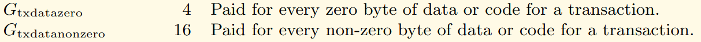

# Bien nommer vos fonctions en Solidity : Maximisez l'efficacité des EVMs

<!-- TOC -->

- [Bien nommer vos fonctions en Solidity : Maximisez l'efficacité des EVMs](#bien-nommer-vos-fonctions-en-solidity--maximisez-lefficacit%C3%A9-des-evms)
	- [TL;DR](#tldr)
	- [Introduction](#introduction)
	- [Présentation du "function dispatcher"](#pr%C3%A9sentation-du-function-dispatcher)
	- [Fonctionnement](#fonctionnement)
	- [Idnetités et Signatures des fonctions](#idnetit%C3%A9s-et-signatures-des-fonctions)
		- [En Solidity](#en-solidity)
			- [Rappel sur les visibilités des fonctions Solidity](#rappel-sur-les-visibilit%C3%A9s-des-fonctions-solidity)
			- [À la compilation](#%C3%A0-la-compilation)
				- [Code généré](#code-g%C3%A9n%C3%A9r%C3%A9)
				- [Diagramme](#diagramme)
				- [Ordre d'évaluation](#ordre-d%C3%A9valuation)
				- [getter automatique](#getter-automatique)
		- [En Yul](#en-yul)
	- [Ça se complique !](#%C3%A7a-se-complique-)
		- [Seuils](#seuils)
		- [fonctions](#fonctions)
		- [Pseudo-code](#pseudo-code)
		- [Calcul des couts en Gas](#calcul-des-couts-en-gas)
		- [Statistiques de consommation](#statistiques-de-consommation)
	- [Algorithmes et ordre de traitement](#algorithmes-et-ordre-de-traitement)
		- [Recherche linéaire](#recherche-lin%C3%A9aire)
		- [Recherche "binaire"](#recherche-binaire)
	- [Les optimisations](#les-optimisations)
		- [Optimisation à l'exécution](#optimisation-%C3%A0-lex%C3%A9cution)
		- [Optimisation à la transaction](#optimisation-%C3%A0-la-transaction)
	- [Conclusions](#conclusions)
	- [Liens](#liens)

<!-- /TOC -->


## TL;DR

- Le "*function dispatcher*" est une interface d'accès au smart contract, c'est la porte d'entrée de l'extérieur vers le contrat.
- Ne concerne que les fonctions ayant un accès vers l'extérieur du contrat.
- Pourrait s'appeler "external access dispatcher", car concerne aussi les données publiques.
- Coder en Yul, résout la problématique de l'odonnancement.
- Le renommage approprié des noms de fonctions est une optimisation de Gas, au déploiement comme à l'exécution de ces dernières.


## Introduction

L'optimisation des coûts en Gas est un enjeu clé dans le développement de contrats intelligents sur la blockchain Ethereum. Chaque opération effectuée sur Ethereum a un coût en Gas, qui dépend en partie de la complexité des fonctions appelées.

Dans cet article, nous allons explorer comment le simple fait de nommer vos fonctions peut influencer les coûts en Gas associés à votre contrat.

Nous discuterons de diverses stratégies d'optimisation, de l'ordre des hash de signatures aux astuces de renommage des fonctions, afin de réduire les coûts de déploiement et d'appel de vos contrats.


## Présentation du "function dispatcher"

Le "*function dispatcher*" (ou gestionnaire de fonctions) dans les contrats intelligents (*smart contracts*) écrits pour les **EVMs** est un élément du contrat qui permet de déterminer quelle fonction doit être exécutée lorsque quelqu'un interagit avec le contrat au travers d'une API.

Si on imagine un contrat intelligent comme une boîte noire avec des fonctions à l'intérieur.  Ces fonctions peuvent être comme des commandes que vous pouvez donner à la boîte pour lui faire faire différentes choses.

Le "*function dispatcher*" écoute les commandes et dirige chaque commande vers la fonction appropriée à l'intérieur de la boîte.  En cela il est le reflet de l'**ABI** coté EVM.

Lorsque vous interagissez avec un contrat intelligent en utilisant une application ou une transaction, vous spécifiez quelle fonction vous souhaitez exécuter. Le "*function dispatcher*" fait donc le lien entre la commande et la fonction spécifique qui sera appelée et exécutée.

En résumé, le "*function dispatcher*" est comme un chef d'orchestre lors des appels aux fonctions d'un contrat intelligent. Il garantit que les bonnes fonctions sont appelées lorsque vous effectuez les bonnes actions sur le contrat.


## Fonctionnement

Lors d'un appel à une fonction d'un smart contract, le "*function dispatcher*" récupère l'identité dans le `calldata` produit un `revert` si l'appel ne peut être mis en relation avec une fonction du contrat.

Le mécanisme de sélection est similaire, à un celui d'une structure `switch/case` ou d'un ensemble de `if/else` tel qu'on le trouve dans de nombreux autres langages de programmation.


## Idnetités et Signatures des fonctions

La **signature** d'une fonction tel que employée avec les **EVMs** (Solidity) consiste en la concaténation de son nom et de ses paramètres (sans noms de paramètre, sans type de retour et sans espace)

L'**identité** (*"selector" dans certaines publications anglo-saxonnes*) est l'identité même de la fonction qui la rend "unique" et identifiable, dans le cas de Solidity, il s'agit des 4 octets de poids fort (32 bits) du résultat du hachage de la signature de la fonction avec l'algorithme [**Keccak-256**](https://www.geeksforgeeks.org/difference-between-sha-256-and-keccak-256/)  (🇬🇧).

Cela selon les [**spécifications de l'ABI en Solidity**](https://docs.soliditylang.org/en/develop/abi-spec.html#function-selector)  (🇬🇧).

Je précise bien que je parle de l'identité pour le compilateur **Solidity**, ce n'est pas forcément le cas avec d'autres langages comme **Rust** qui fonctionne sur un tout autre paradigme.

Si les types des paramètres sont pris en compte, c'est pour différencier les fonctions qui auraient le même nom, mais des paramètres différents, comme pour la méthode `safeTransferFrom` des tokens  [**ERC721**](https://eips.ethereum.org/EIPS/eip-721)  (🇬🇧).

Cependant, le fait que l'on ne garde que **quatre octets** pour l'identité, implique de potentiels **risques de collisions de hash** entre deux fonctions, risque rare, mais existant malgré plus de 4 milliards de possibilités (2^32).

Comme en atteste le site [**Ethereum Signature Database**](https://www.4byte.directory/signatures/?bytes4_signature=0xcae9ca51)  (🇬🇧) avec l'exemple suivant :

| Identités    | Signatures                                                   |
| ------------ | ------------------------------------------------------------ |
| `0xcae9ca51` | `onHintFinanceFlashloan(address,address,uint256,bool,bytes)` |
| `0xcae9ca51` | `approveAndCall(address,uint256,bytes)`                      |

Un simple contrat Solidity doté de ces deux fonctions ne se compile heureusement pas.

```
TypeError: Function signature hash collision for approveAndCall(address,uint256,bytes)
  --> contracts/HashCollision.sol:10:1:
   |
10 | contract HashCollision {
   | ^ (Relevant source part starts here and spans across multiple lines).
```

Mais n'en demeure pas moins problématique : Voir le challenge [**Hint-finance**](https://github.com/paradigmxyz/paradigm-ctf-2022/tree/main/hint-finance), au [**Web3 Hacking: Paradigm CTF 2022**](https://medium.com/amber-group/web3-hacking-paradigm-ctf-2022-writeup-3102944fd6f5) (🇬🇧)


### En Solidity

En mettant en application ce qui a été dit plus haut, on obtient, pour la fonction suivante :

```solidity
function square(uint32 num) public pure returns (uint32) {
    return num * num;
}
```

Les signature, hash et identité suivantes :

| Fonction  | square(uint32 num) public pure returns (uint32)                    |
| --------- | ------------------------------------------------------------------ |
| Signature | `square(uint32)`                                                   |
| Hash      | `d27b38416d4826614087db58e4ea90ac7199f7f89cb752950d00e21eb615e049` |
| Identité  | `d27b3841`                                                         |


En Solidity, le "*function dispatcher*" est généré par le compilateur, inutile donc de se charger du codage de cette tâche complexe. 

Il ne concerne que les fonctions d'un contrat ayant un accès vers l'extérieur de celui-ci, en l'occurrence les fonctions ayant pour attribut d'accès external et public


#### Rappel sur les visibilités des fonctions Solidity

1. **External** : Les fonctions externes sont conçues pour être appelées depuis l'**extérieur du contrat**, généralement par d'autres contrats ou des comptes externes. C'est le niveau de visibilité que vous utilisez lorsque vous souhaitez exposer une interface publique à votre contrat.

2. **Public** : Les fonctions publiques sont similaires aux fonctions externes, mais elles offrent également une méthode de lecture de données qui ne consomme pas de Gas. Les fonctions publiques sont accessibles depuis l'**extérieur du contrat**.

3. **Internal** : Les fonctions internes peuvent être appelées à l'**intérieur du contrat**, ainsi que depuis d'autres **contrats héritant** du contrat actuel. Elles ne sont pas accessibles depuis l'extérieur du contrat via une transaction directe.

**Exemple #1** :

```solidity
pragma solidity 0.8.13;

contract MyContract {
    uint256 public value;
    uint256 internalValue;

    function setValue(uint256 _newValue) external {
        value = _newValue;
    }

    function getValue() public view returns (uint256) {
        return value;
    }

    function setInternalValue(uint256 _newValue) internal {
        internalValue = _newValue;
    }

    function getInternalValue() public view returns (uint256) {
        return internalValue;
    }
}
```

Dans cet exemple, la fonction `setValue` est marquée comme "*external*" car elle modifie l'état du contrat et doit être appelée depuis l'extérieur.

La fonction `getValue` est marquée comme étant "*public*", elle permet ainsi de lire la valeur sans en modifier l'état.

La fonction `setInternalValue` peut être appelée à partir de l'intérieur du contrat lui-même ou par **d'autres contrats** qui héritent de `MyContract`.

La fonction `getInternalValue` est publique et permet de lire la valeur de `internalValue`.


#### À la compilation

Si nous reprenons le précédent code utilisé en exemple, nous obtenons les signatures et Identités suivantes :

| Fonctions                                              | Signatures                  | Keccak            | Identités      |
| ------------------------------------------------------ | --------------------------- | ----------------- | -------------- |
| **`setValue(uint256 _newValue) external`**             | `setValue(uint256)`         | `55241077...ecbd` | **`55241077`** |
| **`getValue() public view returns (uint256)`**         | `getValue()`                | `20965255...ad96` | **`20965255`** |
| **`setInternalValue(uint256 _newValue) internal`**     | `setInternalValue(uint256)` | `6115694f...7ce1` | **`6115694f`** |
| **`getInternalValue() public view returns (uint256)`** | `getInternalValue()`        | `e778ddc1...c094` | **`e778ddc1`** |

(*Les hashs issus du Keccak ont été tronqués volontairement*)

Si on examine l'ABI généré lors de la compilation, la fonction `setInternalValue()` n'apparait pas, ce qui est normal, sa visibilité étant `internal` (voir plus haut)

On notera dans les données de l'ABI, la référence à la donnée du storage `value` qui est `public` (on y reviendra plus loin)


##### Code généré

Voici en extrait le code du "*function dispatcher*" généré par le compilateur `solc` (version de solidity : 0.8.13)

```yul
tag 1
  JUMPDEST 
  POP 
  PUSH 4
  CALLDATASIZE 
  LT 
  PUSH [tag] 2
  JUMPI 
  PUSH 0
  CALLDATALOAD 
  PUSH E0
  SHR 
  DUP1 
  PUSH 20965255
  EQ 
  PUSH [tag] getValue_0
  JUMPI 
  DUP1 
  PUSH 3FA4F245  
  EQ 
  PUSH [tag] 4
  JUMPI 
  DUP1 
  PUSH 55241077
  EQ 
  PUSH [tag] setValue_uint256_0
  JUMPI 
  DUP1 
  PUSH E778DDC1
  EQ 
  PUSH [tag] getInternalValue_0
  JUMPI 
tag 2
  JUMPDEST 
  PUSH 0
  DUP1 
  REVERT
```

##### Diagramme

Sous forme de diagramme, on comprend mieux la suite de structure de `if/else` en cascade.


<!--  -->


##### Ordre d'évaluation

**Important** : L'ordre d'évaluation des fonctions n'est pas le même que celui de déclaration dans le code !

| Ordre d'évaluation | Ordre dans le code | Identités   | Signatures                     |
| ------------------ | ------------------ | ----------- | ------------------------------ |
| 1                  | **3**              | `20965255`  | `getValue()`                   |
| 2                  | **1**              | `3FA4F245`  | `value` (*getter automatique*) |
| 3                  | **2**              | `55241077`  | `setValue(uint256)`            |
| 4                  | **4**              | `E778DDC1`  | `getInternalValue()`           |

En effet, les évaluations des Identités de fonctions sont ordonnées par un tri ascendant sur leurs valeurs.

`20965255` < `3FA4F245` < `55241077` < `E778DDC1`


##### getter() automatique

La fonction d'identité `3FA4F245` est en fait un **getter** automatique de la donnée publique `value`, elle est générée par le compilateur.

```solidity
  uint256 public value;
```

Nous retrouvons d'ailleurs dans les opcodes, l'identité de sélection (`3FA4F245`) et la fonction (à l'adresse `tag 4`) du getter automatique pour cette variable.

**Sélecteur** :
```yul
  DUP1 
  PUSH 3FA4F245  
  EQ 
  PUSH [tag] 4
  JUMPI 
```

**Fonction** :
```yul
tag 4
  JUMPDEST 
  PUSH [tag] 11
  PUSH [tag] 12
  JUMP [in]
tag 11
  JUMPDEST 
  PUSH 40
  MLOAD 
  PUSH [tag] 13
  SWAP2 
  SWAP1 
  PUSH [tag] abi_encode_tuple_t_uint256__to_t_uint256__fromStack_reversed_0
  JUMP [in]
tag 13
  JUMPDEST 
  PUSH 40
  MLOAD 
  DUP1 
  SWAP2 
  SUB 
  SWAP1 
  RETURN
```

`getter` ayant d'ailleurs un code identique à celui de la fonction `getValue()`

```yul
tag getValue_0
  JUMPDEST 
  PUSH [tag] getValue_1
  PUSH [tag] getValue_3
  JUMP [in]
tag getValue_1
  JUMPDEST 
  PUSH 40
  MLOAD 
  PUSH [tag] getValue_2
  SWAP2 
  SWAP1 
  PUSH [tag] abi_encode_tuple_t_uint256__to_t_uint256__fromStack_reversed_0
  JUMP [in]
tag getValue_2
  JUMPDEST 
  PUSH 40
  MLOAD 
  DUP1 
  SWAP2 
  SUB 
  SWAP1 
  RETURN 
```

Démontrant ainsi l'inutilité d'avoir la variable `value` avec l'attribut `public` de concert avec la fonction `getValue()` mais également une faiblesse du compilateur de Solidity `solc` qui ne peut fusionner le code des deux fonctions.

Voici d'ailleurs un lien, pour ceux qui voudraient aller plus loin, [**un article détaillé**](https://medium.com/coinmonks/soliditys-cheap-public-face-b4e972e3924d) (🇬🇧) sur les `automatic storage getters` en Solidity. Dont on peut résumé le contenu en quatre points essentiels.

1. Utilisez les getters automatique de Solidity lorsque cela est possible, car ils seront toujours similaires ou moins chers en Gas que les getters explicites. Dans certains cas, par exemple une structure de stockage publique (`public` storage) ils peuvent être le seul moyen de fournir un getter.

2. Bien que le code source du contrat avec les getters automatique soit plus court que celui avec des getters explicites, le coût du Gas est sensiblement le même. Les getters automatiques ne sont pas « *gratuits* ».

3. Ne publiez que les variables de stockage qui sont essentiels, en raison du coût du Gas. En particulier, essayez d'éviter les getters pour les structures de données dynamiques. Les types de structures complexes, y compris les chaînes, sont assez coûteux à rendre publics.

4. Des getters explicites peuvent être requis pour les types `array` et `mapping`. Ils ne sont pas générés automatiquement.


### En Yul

Voici un extrait d'un exemple de [**contrat ERC20**](https://docs.soliditylang.org/en/develop/yul.html#complete-erc20-example) (🇬🇧) entièrement écrit en **Yul**.

```yul
object "runtime" {
    code {
        // Protection against sending Ether
        require(iszero(callvalue()))

        // Dispatcher
        switch selector()
        case 0x70a08231 /* "balanceOf(address)" */ {
            returnUint(balanceOf(decodeAsAddress(0)))
        }
        case 0x18160ddd /* "totalSupply()" */ {
            returnUint(totalSupply())
        }
        case 0xa9059cbb /* "transfer(address,uint256)" */ {
            transfer(decodeAsAddress(0), decodeAsUint(1))
            returnTrue()
        }
        case 0x23b872dd /* "transferFrom(address,address,uint256)" */ {
            transferFrom(decodeAsAddress(0), decodeAsAddress(1), decodeAsUint(2))
            returnTrue()
        }
        case 0x095ea7b3 /* "approve(address,uint256)" */ {
            approve(decodeAsAddress(0), decodeAsUint(1))
            returnTrue()
        }
        case 0xdd62ed3e /* "allowance(address,address)" */ {
            returnUint(allowance(decodeAsAddress(0), decodeAsAddress(1)))
        }
        case 0x40c10f19 /* "mint(address,uint256)" */ {
            mint(decodeAsAddress(0), decodeAsUint(1))
            returnTrue()
        }
        default {
            revert(0, 0)
        }

        /* ---------- calldata decoding functions ----------- */
        function selector() -> s {
            s := div(calldataload(0), 0x100000000000000000000000000000000000000000000000000000000)
        }

  ...

```

On y retrouve la suite de structure de `if/else` en cascade, identique au diagramme précédent.

Réaliser un contrat **100% en Yul**, oblige à coder soi-même le "*function dispatcher*", ce qui implique que l'on peut choisir l'ordre de traitement des identités, ainsi qu'utiliser d'autres algorithmes qu'une simple suite de tests en cascade.


## Ça se complique !

Maintenant, voici un tout autre exemple pour illustrer le fait que les choses sont plus complexes que cela en fonction du **nombre de fonctions** et du **niveau d'optimisation** du compilateur Solidity (voir : `--optimize-runs`) !

**Exemple #2** :

```solidity
// SPDX-License-Identifier: GPL-3.0

pragma solidity 0.8.17;

contract Storage {

    uint256 numberA;
    uint256 numberB;
    uint256 numberC;
    uint256 numberD;
    uint256 numberE;


    // identity : C534BE7A
    function storeA(uint256 num) public {
        numberA = num;
    }

    // identity : 9AE4B7D0
    function storeB(uint256 num) public {
        numberB = num;
    }

    // identity : 4CF56E0C
    function storeC(uint256 num) public {
        numberC = num;
    }

    // identity : B87C712B
    function storeD(uint256 num) public {
        numberD = num;
    }

    // identity : E45F4CF5
    function storeE(uint256 num) public {
        numberE = num;
    }

    // identity : 2E64CEC1
    function retrieve() public view returns (uint256) {
        return Multiply( numberA, numberB, numberC, numberD);
    }


    function Multiply(uint a, uint b, uint c, uint d) pure private returns(uint256) {
        return a * b * c * d;
    }

    function MultiplyBis(uint a, uint b, uint c, uint d) pure private returns(uint256) {
        return a * b * c * d;
    }

}
```
Nous avons bien 6 fonctions présentes dans le JSON de l'ABI. Les **6 fonctions `public`** suivantes avec leur identités dédiées :

| Fonctions                                      | Signatures        | Identités      |
| ---------------------------------------------- | ----------------- | -------------- |
| **`storeA(uint256 num) public`**               | `storeA(uint256)` | **`C534BE7A`** |
| **`storeB(uint256 num) public`**               | `storeB(uint256)` | **`9AE4B7D0`** |
| **`storeC(uint256 num) public`**               | `storeC(uint256)` | **`4CF56E0C`** |
| **`storeD(uint256 num) public`**               | `storeD(uint256)` | **`B87C712B`** |
| **`storeE(uint256 num) public`**               | `storeE(uint256)` | **`E45F4CF5`** |
| **`retrieve() public view returns (uint256)`** | `retrieve()`      | **`2E64CEC1`** |

Suivant le [**niveau d'optimisation**](https://docs.soliditylang.org/en/develop/internals/optimizer.html) (🇬🇧) du compilateur, nous obtenons un code différent pour le "*function dispatcher*".

Avec un niveau à **200** (*`--optimize-runs 200`*) nous obtenons le type de code précédemment généré, avec ses `if/else` en cascade.

```yul
tag 1
  JUMPDEST 
  POP 
  PUSH 4
  CALLDATASIZE 
  LT 
  PUSH [tag] 2
  JUMPI 
  PUSH 0
  CALLDATALOAD 
  PUSH E0
  SHR 
  DUP1 
  PUSH 2E64CEC1
  EQ 
  PUSH [tag] retrieve_0
  JUMPI 
  DUP1 
  PUSH 4CF56E0C
  EQ 
  PUSH [tag] storeC_uint256_0
  JUMPI 
  DUP1 
  PUSH 9AE4B7D0
  EQ 
  PUSH [tag] storeB_uint256_0
  JUMPI 
  DUP1 
  PUSH B87C712B
  EQ 
  PUSH [tag] storeD_uint256_0
  JUMPI 
  DUP1 
  PUSH C534BE7A
  EQ 
  PUSH [tag] storeA_uint256_0
  JUMPI 
  DUP1 
  PUSH E45F4CF5
  EQ 
  PUSH [tag] storeE_uint256_0
  JUMPI 
  PUSH 0
  DUP1
  REVERT
```

Par contre, avec un niveau de `runs` plus élevé (*`--optimize-runs 300`*)

```yul
tag 1
  JUMPDEST
  POP
  PUSH 4
  CALLDATASIZE
  LT
  PUSH [tag] 2
  JUMPI
  PUSH 0
  CALLDATALOAD
  PUSH E0
  SHR
  DUP1
  PUSH B87C712B
  GT
  PUSH [tag] 9
  JUMPI
  DUP1
  PUSH B87C712B
  EQ
  PUSH [tag] storeD_uint256_0
  JUMPI
  DUP1
  PUSH C534BE7A
  EQ
  PUSH [tag] storeA_uint256_0
  JUMPI
  DUP1
  PUSH E45F4CF5
  EQ
  PUSH [tag] storeE_uint256_0
  JUMPI
  PUSH 0
  DUP1
  REVERT
tag 9
  JUMPDEST
  DUP1
  PUSH 2E64CEC1
  EQ
  PUSH [tag] retrieve_0
  JUMPI
  DUP1
  PUSH 4CF56E0C
  EQ
  PUSH [tag] storeC_uint256_0
  JUMPI
  DUP1
  PUSH 9AE4B7D0
  EQ
  PUSH [tag] storeB_uint256_0
  JUMPI
tag 2
  JUMPDEST
  PUSH 0
  DUP1
  REVERT
```

Les opcodes et le flux d'exécution, ne sont plus les mêmes.


On voit que les tests sont "découpés" en deux recherches linéaires autour d'une valeur pivot `B87C712B`. Diminuant ainsi la consommation pour les cas les moins favorables `storeB(uint256)` et `storeE(uint256)`.


### Seuils

Seulement **4 tests** pour les fonctions `storeB(uint256)` et `storeE(uint256)`, au lieu de respectivement **3 tests** et **6 tests** avec le précédent algorithme.

La détermination du déclenchement de ce type d'optimisation est un peu délicat, le seuil du nombre de fonctions se trouve être 6 pour le déclencher avec `--optimize-runs 284`, donnant **deux tranches** de 3 séries de tests linéaires.


### 11 fonctions

Avec **11 fonctions** éligibles, et un niveau de `runs` supérieur `--optimize-runs 1000`  on passe de **deux tranches** (une de 6 + une de 5) à **4 tranches** (trois tranches de 3 + une de 2)

Ces seuils (valeur de `runs`) sont-t-il susceptibles d'évoluer au fil des versions du compilateur `solc` ?


### Pseudo-code

Cette fois-ci, je ne reproduit pas les opcodes et le diagramme associé, afin de clarifier l'explication, voici le flux d'exécution sous forme de *pseudo-code*, semblable à du code **C**.

```c
// [tag 1]
// 1 Gas (JUMPDEST)
if( selector >= 0x799EBD70) {  // 22 = (3+3+3+3+10) Gas
  if( selector >= 0xB9E9C35C) {  // 22 = (3+3+3+3+10) Gas
    if( selector == 0xB9E9C35C) { goto storeF }  // 22 = (3+3+3+3+10) Gas
    if( selector == 0xC534BE7A) { goto storeA }  // 22 = (3+3+3+3+10) Gas
    if( selector == 0xE45F4CF5) { goto storeE }  // 22 = (3+3+3+3+10) Gas
    revert()
  }
  // [tag 15]
  // 1 Gas (JUMPDEST)
  if( selector == 0x799EBD70) { goto storeG }  // 22 = (3+3+3+3+10) Gas
  if( selector == 0x9AE4B7D0) { goto storeB }  // 22 = (3+3+3+3+10) Gas
  if( selector == 0xB87C712B) { goto storeD }  // 22 = (3+3+3+3+10) Gas
  revert()
} else {
  // [tag 14]
  // 1 Gas (JUMPDEST)
  if( selector >= 0x4CF56E0C) { // 22 = (3+3+3+3+10) Gas
    if( selector == 0x4CF56E0C) { goto storeC }  // 22 = (3+3+3+3+10) Gas
    if( selector == 0x6EC51CF6) { goto storeJ }  // 22 = (3+3+3+3+10) Gas
    if( selector == 0x75A64B6D) { goto storeH }  // 22 = (3+3+3+3+10) Gas
    revert()
  }
  // [tag 16]
  // 1 Gas (JUMPDEST)
  if( selector == 0x183301E7) { goto storeI }    // 22 = (3+3+3+3+10) Gas
  if( selector == 0x2E64CEC1) { goto retrieve }  // 22 = (3+3+3+3+10) Gas
  revert()
}
```

On distingue mieux les articulations autour des différentes valeurs "pivots" `799EBD70`, `0x4CF56E0C` et `0xB9E9C35C`.


### Calcul des couts en Gas

J'ai pris pour référence toujours le même code d'un contrat Solidity avec **11 fonctions éligibles** au "*function dispatcher*", afin d'estimer le cout en Gas, selon que l'on ait une recherche linéaire ou "binaire".

- On ne prendra pas en compte dans les couts en Gas la portion de code qui va extraire l'identité de la fonction, en allant chercher la donnée dans la zone `calldata`.

- Ni les couts de Gas nécessaire au stockage de données dans l'EVM

- De même ne sera pas pris en compte les cas ou la recherche échouera et aboutira donc à un `revert`.

- C'est uniquement le **cout de la sélection** dans le "*function dispatcher*" et non l'exécution des fonctions qui est estimé. Nous ne nous préoccupons pas de ce que fait la fonction elle-même ni de ce qu'elle consomme comme Gas.

L'estimation des couts en Gas des opcodes utilisés ont été réalisés en m'aidant des sites suivants :
- [**Ethereum Yellow Paper**](https://ethereum.github.io/yellowpaper/paper.pdf) (🇬🇧)
- [**EVM Codes - An Ethereum Virtual Machine Opcodes Interactive Reference**](https://www.evm.codes/?fork=shanghai) (🇬🇧)


Les **opcodes** en jeu sont ainsi les suivants :

| Mnemonic           | Gas | Description                             |
| ------------------ | --- | --------------------------------------- |
| `JUMPDEST`         | 1   | Mark valid jump destination.            |
| `DUP1`             | 3   | Clone 1st value on stack                |
| `PUSH4 0xXXXXXXXX` | 3   | Push 4-byte value onto stack.           |
| `GT`               | 3   | Greater-than comparison.                |
| `EQ`               | 3   | Equality comparison.                    |
| `PUSH [tag]`       | 3   | Push 2-byte value onto stack.           |
| `JUMPI`            | 10  | Conditionally alter the program counter |


Ce qui m'a permit d'estimer les couts en Gas de recherche de chaque fonction, selon l'algorithme.

| Signatures        | Identités        | Gas (linear)    | Gas (binary)    |
| ----------------- | ---------------- | --------------- | --------------- |
| `storeI(uint256)` | `183301E7`       | **22 (*min*)**  | 69              |
| `retrieve()`      | `2E64CEC1`       | 44              | 91              |
| `storeC(uint256)` | `4CF56E0C` (*2*) | 66              | 69              |
| `storeJ(uint256)` | `6EC51CF6`       | 88              | 90              |
| `storeH(uint256)` | `75A64B6D`       | 110             | **112 (*max*)** |
| `storeG(uint256)` | `799EBD70` (*1*) | 132             | 68              |
| `storeB(uint256)` | `9AE4B7D0`       | 154             | 90              |
| `storeD(uint256)` | `B87C712B`       | 176             | **112 (*max*)** |
| `storeF(uint256)` | `B9E9C35C` (*2*) | 198             | **67 (*min*)**  |
| `storeA(uint256)` | `C534BE7A`       | 220             | 89              |
| `storeE(uint256)` | `E45F4CF5`       | **242 (*max*)** | 111             |

- (*1*) : *premier seuil*
- (*2*) : *seuils secondaires*


### Statistiques de consommation

Si on regarde d'un peu plus près le résultat de certaines **statistiques** sur les deux types de recherche.

| \          | Linear | Binary    |
| ---------- | ------ | --------- |
| Min        | **22** | 67        |
| Max        | 242    | **112**   |
| Moyenne    | 132    | **88**    |
| Ecart-type | 72,97  | **18,06** |

On constate des différences notables. En l'occurrence, une **moyenne** plus basse (*-33%*) avec une [**dispersion**](https://fr.wikipedia.org/wiki/%C3%89cart_type) des consommations considérablement plus faible (*4 fois moins*) en faveur de la recherche "binaire".


## Algorithmes et ordre de traitement

Suivant l'algorithme utilisé par le compilateur Solidity pour générer le "*function dispatcher*", l'ordre de traitement des fonctions sera différent, aussi bien de l'ordre de déclaration dans le code source que de l'ordre alphabétique.


### Recherche linéaire

| #      | Signatures        |
| ------ | ----------------- |
| **1**  | `storeI(uint256)` |
| **2**  | `retrieve()`      |
| **3**  | `storeC(uint256)` |
| **4**  | `storeJ(uint256)` |
| **5**  | `storeH(uint256)` |
| **6**  | `storeG(uint256)` |
| **7**  | `storeB(uint256)` |
| **8**  | `storeD(uint256)` |
| **9**  | `storeF(uint256)` |
| **10** | `storeA(uint256)` |
| **11** | `storeE(uint256)` |

Le nombre de tests et la complexité du processus est proportionnelle au nombre de fonctions, en [**O(n)**](https://fr.wikipedia.org/wiki/Complexit%C3%A9_en_temps#Liste_de_complexit%C3%A9s_en_temps_classiques).


### Recherche "binaire"

| #      | Signatures        |
| ------ | ----------------- |
| **1**  | `storeF(uint256)` |
| **2**  | `storeG(uint256)` |
| **3**  | `storeI(uint256)` |
| **4**  | `storeC(uint256)` |
| **5**  | `storeA(uint256)` |
| **6**  | `storeJ(uint256)` |
| **7**  | `storeB(uint256)` |
| **8**  | `retrieve()`      |
| **9**  | `storeE(uint256)` |
| **10** | `storeH(uint256)` |
| **11** | `storeD(uint256)` |

Il ne s'agit pas d'une [**recherche dichotomique**](https://fr.wikipedia.org/wiki/Recherche_dichotomique) au sens strict du terme, mais plutôt d'un découpage en groupes de tests séquentiels autour de valeurs pivots. Mais au final, la complexité est identique, en [**O(log n)**](https://fr.wikipedia.org/wiki/Complexit%C3%A9_en_temps#Liste_de_complexit%C3%A9s_en_temps_classiques).


## Les optimisations

Si on part sur le principe que les fonctions sont appelées de manière équitable (à la même fréquance d'utilisation) celles-ci lors de leurs appels ne couteront pas la même chose en fonction de leurs signatures (*et par là même de leurs noms*). On voit clairement que tel quel le cout de la sélection d'un appel vers ces fonctions, quel que soit l'algorithme, est très hétérogène et s'il peut être estimé, il ne peut être imposé.

Cependant, en renommant stratégiquement les fonctions, en ajoutant des suffixes, vous pouvez influencer le résultat des signatures de fonctions et, par conséquent, les coûts de gaz associés à ces fonctions. Cette pratique peut permettre d'optimiser la consommation de gaz dans votre contrat intelligent, lors de l'appel de la fonction dans l'EVM, mais aussi, comme nous le verrons plus loin, lors des transactions.


### Optimisation à l'exécution

Pour illustrer la chose, la signature de la fonction `square(uint32)` modifiée ainsi `square_low(uint32)` aura pour identité `bde6cad1` au lieu de `d27b3841`.

La valeur inférieure de la nouvelle identité obtenue fera ainsi remonter en priorité le traitement de l'appel de cette fonction.

Cette optimisation peut être importante pour les contrats intelligents très complexes, car elle permet de réduire le temps nécessaire pour rechercher et sélectionner la bonne fonction à appeler, ce qui se traduit par des économies de gaz et des performances améliorées sur la blockchain Ethereum.

Le fait que la recherche soit "binaire" au lieu de linéaire, complique un peu les choses, dans le sens ou en fonction du nombre de fonctions et du niveau d'optimisation du compilateur, les valeurs seuils sont plus délicates à déterminer


### Optimisation à la transaction

Lorsque vous envoyez une transaction sur la blockchain Ethereum, vous incluez généralement des données qui spécifient quelle fonction du contrat intelligent vous souhaitez appeler et quels sont les arguments de cette fonction. Or le coût en gaz d'une transaction dépend en partie du nombre d'octets à zéro dans les données de cette transaction. 

Comme précisé dans l'[**Ethereum Yellow Paper**](https://ethereum.github.io/yellowpaper/paper.pdf) (🇬🇧)



Pour illustrer la chose, la signature de la fonction `square(uint32)` modifiée ainsi `square_Y7i(uint32)` aura pour identité `00001878` au lieu de `d27b3841`.

Les deux octets de poids forts de l'identité, feront non seulement remonter en priorité le **traitement de l'appel** de cette fonction, mais permettra également de consommer **moins de Gas** lors de la transaction (**40** au lieu de **64**).

En voici d'autres exemples :

- `deposit_ps2(uint256)` au lieu de `deposit_ps2(uint256)`
- `mint_540(uint256)` au lieu de `mint(uint256)`
- `b_A6Q()` au lieu de `b()`

Idéalement, il faudrait trouver des identités avec **trois octets** de poids forts à zéro, permettant ainsi de ne consommer que **28 Gas**.


## Conclusions

- L'optimisation des coûts en Gas est un aspect essentiel de la conception de contrats intelligents efficaces sur Ethereum.

- En faisant attention aux détails tels que l'ordre des signatures de fonction, le nombre de zéros en début de hash, l'ordre de traitement des fonctions, et le renommage des fonctions, vous pouvez réduire de manière significative les coûts associés à votre contrat.

- **Attention** toutefois la convivialité et la lisibilité de votre code, peut en être légerement réduite.

- L'optimisation pour l'exécution n'est pas nécessaire pour les fonctions dites d'administration, ou celle trop peu fréquement appelées.

- Par contre, c'est à prioriser pour les fonctions supposément les plus fréquemment appelées (à déterminer manuellement ou statistiquement lors de tests pratiques).

En fin de compte, ces optimisations peuvent faire la différence entre un contrat économique et un contrat coûteux en Gas.

--------

Crédits : **Franck Maussand franck@maussand.net**

*Merci à [**Igor Bournazel**](https://github.com/ibourn) pour la relecture de cet article.*

--------

<!-- *Merci à [**Igor Bournazel**](https://github.com/ibourn) pour la relecture de cet article.* -->


## Liens

- Fonction de hachage
  - 🇫🇷 [Fonction de hachage — Wikipédia](https://fr.wikipedia.org/wiki/Fonction_de_hachage)
  - 🇬🇧 [Hash function - Wikipedia](https://en.wikipedia.org/wiki/Hash_function)

- Keccak
  - 🇫🇷 [SHA-3 — Wikipédia](https://fr.wikipedia.org/wiki/SHA-3)
  - 🇬🇧 [SHA-3 - Wikipedia](https://en.wikipedia.org/wiki/SHA-3)
  - 🇬🇧 [Difference Between SHA-256 and Keccak-256 - GeeksforGeeks](https://www.geeksforgeeks.org/difference-between-sha-256-and-keccak-256/)

- Recherche dichotomique
  - 🇫🇷 [Recherche dichotomique — Wikipédia](https://fr.wikipedia.org/wiki/Recherche_dichotomique)
  - 🇬🇧 [Binary search algorithm - Wikipedia](https://en.wikipedia.org/wiki/Binary_search_algorithm)
  - 🇫🇷 [Calculer la performance d'un algorithme avec la notation Big-O](https://buzut.net/cours/computer-science/time-complexity)
  - 🇬🇧 [Big O notation - Wikipedia](https://en.wikipedia.org/wiki/Big_O_notation)

- Reférences
  - 🇬🇧 [Ethereum Yellow Paper](https://ethereum.github.io/yellowpaper/paper.pdf)
  - 🇬🇧 [Opcodes for the EVM](https://ethereum.org/en/developers/docs/evm/opcodes/)
  - 🇬🇧 [EVM Codes - An Ethereum Virtual Machine Opcodes Interactive Reference](https://www.evm.codes/?fork=shanghai)
  - 🇬🇧 [Operations with dynamic Gas costs](https://github.com/wolflo/evm-opcodes/blob/main/gas.md)
  - 🇬🇧 [Contract ABI Specification — Solidity 0.8.22 documentation](https://docs.soliditylang.org/en/develop/abi-spec.html#function-selector)
  - 🇬🇧 [Yul — Solidity 0.8.22 documentation](https://docs.soliditylang.org/en/latest/yul.html)
  - 🇬🇧 [Yul — Complete ERC20 Example](https://docs.soliditylang.org/en/develop/yul.html#complete-erc20-example)
  - 🇬🇧 [Using the Compiler — Solidity 0.8.22 documentation](https://docs.soliditylang.org/en/latest/using-the-compiler.html)
  - 🇬🇧 [The Optimizer — Solidity 0.8.22 documentation](https://docs.soliditylang.org/en/develop/internals/optimizer.html)

- Outils
  - 🇬🇧 [Keccak-256 Online](http://emn178.github.io/online-tools/keccak_256.html)
  - 🇬🇧 [Compiler Explorer](https://godbolt.org/)
  - 🇬🇧 [Solidity Optimize Name](https://emn178.github.io/solidity-optimize-name/)
  - 🇬🇧 [Ethereum Signature Database](https://www.4byte.directory/)

- Divers
  - 🇬🇧 [Function Dispatching | Huff Language](https://docs.huff.sh/tutorial/function-dispatching/#linear-dispatching)
  - 🇬🇧 [Solidity’s Cheap Public Face](https://medium.com/coinmonks/soliditys-cheap-public-face-b4e972e3924d)
  - 🇬🇧 [Web3 Hacking: Paradigm CTF 2022 Writeup](https://medium.com/amber-group/web3-hacking-paradigm-ctf-2022-writeup-3102944fd6f5)
  - 🇬🇧 [paradigm-ctf-2022/hint-finance at main · paradigmxyz/paradigm-ctf-2022 · GitHub](https://github.com/paradigmxyz/paradigm-ctf-2022/tree/main/hint-finance)

