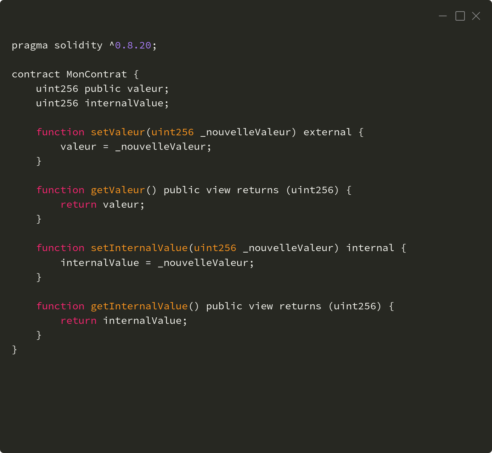

# Noms de fonctions optimals en Solidity

## TL;DR

- Le "function dispatcher" est un gestionnaire d'accès aux fonctions d'un smart contract, c'est la porte d'entrée de l'extérieur vers le contrat.
- Ne concerne que les fonctions ayant un accès vers l'extérieur du contrat.

## Présentation

Le "function dispatcher" (ou gestionnaire de fonctions) dans les contrats intelligents écrits en Solidity est une partie du contrat qui permet de déterminer quelle fonction doit être exécutée lorsque quelqu'un interagit avec le contrat au travers d'une API.

Si on imagine un contrat intelligent comme une boîte noir avec des fonctions à l'intérieur.  Ces fonctions peuvent être comme des commandes que vous pouvez donner à la boîte pour lui faire faire différentes choses.

Le "function dispatcher" écoute les commandes et dirige chaque commande vers la fonction appropriée à l'intérieur de la boîte.

Lorsque vous interagissez avec un contrat intelligent en utilisant une application ou une transaction, vous spécifiez quelle fonction vous souhaitez exécuter. Le "function dispatcher" fait donc le lien entre la commande et la fonction spécifique qui sera appelée et exécutée.

En résumé, le "function dispatcher" est comme un chef d'orchestre pour les appels aux fonctions d'un contrat intelligent. Il garantit que les bonnes fonctions sont appelées lorsque vous effectuez les bonnes actions sur le contrat.

En solidity, le "function dispatcher" est généré via le compilateur, inutile donc de se charger de cette tâche complexe. 

Il ne concerne que les fonctions d'un contrat ayant un accès vers l'extérieur de celui-ci, en l'occurence les fonctions ayant pour attribut d'accès external et public (internal à tester ???)

1. **External** : Les fonctions externes sont conçues pour être appelées depuis l'**extérieur du contrat**, généralement par d'autres contrats ou des comptes externes. C'est le niveau de visibilité que vous utilisez lorsque vous souhaitez exposer une interface publique à votre contrat.

2. **Public** : Les fonctions publiques sont similaires aux fonctions externes, mais elles offrent également une méthode de lecture de données qui ne consomme pas de gaz. Les fonctions publiques sont accessibles depuis l'**extérieur du contrat**.

3. **Internal** : Les fonctions internes peuvent être appelées à l'intérieur du contrat, ainsi que depuis d'autres contrats héritant du contrat actuel. Elles ne sont pas accessibles depuis l'**extérieur du contrat** via une transaction directe.

Par exemple :

Dans cet exemple, la fonction `setValeur` est marquée comme "*external*" car elle modifie l'état du contrat et doit être appelée depuis l'extérieur.

La fonction `getValeur` est marquée comme étant "*public*", elle permet ainsi de lire la valeur sans en modifier l'état.

La fonction `setInternalValue` peut être appelée à partir de l'intérieur du contrat lui-même ou par d'autres contrats qui héritent de `MonContrat`.

La fonction `getInternalValue` est publique et permet de lire la valeur de `internalValue`.

## Un exemple simple

## Signatures des fonctions

Signature d'une fonction en Solidity

keccak
Le hash (signature numérique)
nom + paramètres
4 octets de poid fort -> 32 bits -> 2 ^ 32 = 4294967296 (plus de **4 milliards** de possibilités)

## L'ordre de traitement
- Ordre des fonctions dans le code source
- Ordonnancé par la valeur de hash

## Faire le lien

### Recherche linéaire

### Recherche par dichotomie

## Optimisations

### Optimisation au déploiement

### optimisation à l'exécution

Seuil(s) pivot

Cette opération requiert un temps en **O(log(n))** dans le cas moyen, mais **O(n)** dans le cas critique où l'arbre est complètement déséquilibré et ressemble à une liste chaînée. Ce problème est écarté si l'arbre est équilibré par rotation au fur et à mesure des insertions pouvant créer des listes trop longues. 
[Wikipédia](https://fr.wikipedia.org/wiki/Arbre_binaire_de_recherche#Recherche)

## Conclusions

L'optimisation pour l'exécution, n'est pas nécessaire pour les fonctions dites d'administration. 
Par contre c'est à prioriser pour les fonctions supposément les plus fréquement appelées (à déterminer manuellement ou après évaluation automatique lors de tests pratiques)

Merci à [**Igor Bournazel**](https://github.com/ibourn) pour la relecture de cet article.

## Liens

- Ressources
  - [en] [Keccak-256 Online](http://emn178.github.io/online-tools/keccak_256.html)
  - [en] [Function Dispatching | Huff Language](https://docs.huff.sh/tutorial/function-dispatching/#linear-dispatching)
  
- Recherche dichotomique
  - [fr] [Recherche dichotomique — Wikipédia](https://fr.wikipedia.org/wiki/Recherche_dichotomique)
  - [en] [Binary search algorithm - Wikipedia](https://en.wikipedia.org/wiki/Binary_search_algorithm)
  
- Arbre binaire de recherche
  - [fr] [Arbre binaire de recherche — Wikipédia](https://fr.wikipedia.org/wiki/Arbre_binaire_de_recherche)
  - [en] [Binary search tree - Wikipedia](https://en.wikipedia.org/wiki/Binary_search_tree)
  
- Rotation d'un arbre binaire de recherche
  - [fr] [Rotation d'un arbre binaire de recherche — Wikipédia](https://fr.wikipedia.org/wiki/Rotation_d%27un_arbre_binaire_de_recherche)
  - [en] [Tree rotation - Wikipedia](https://en.wikipedia.org/wiki/Tree_rotation)
  - [en] [Self-balancing binary search tree - Wikipedia](https://en.wikipedia.org/wiki/Self-balancing_binary_search_tree)

- Keccak
  - [fr] [SHA-3 — Wikipédia](https://fr.wikipedia.org/wiki/SHA-3)
  - [en] [SHA-3 - Wikipedia](https://en.wikipedia.org/wiki/SHA-3)

- Fonction de hachage
  - [fr] [Fonction de hachage — Wikipédia](https://fr.wikipedia.org/wiki/Fonction_de_hachage)
  - [en] [Hash function - Wikipedia](https://en.wikipedia.org/wiki/Hash_function)

